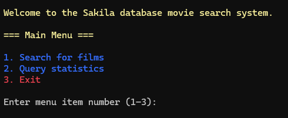
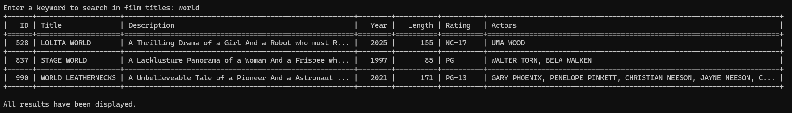
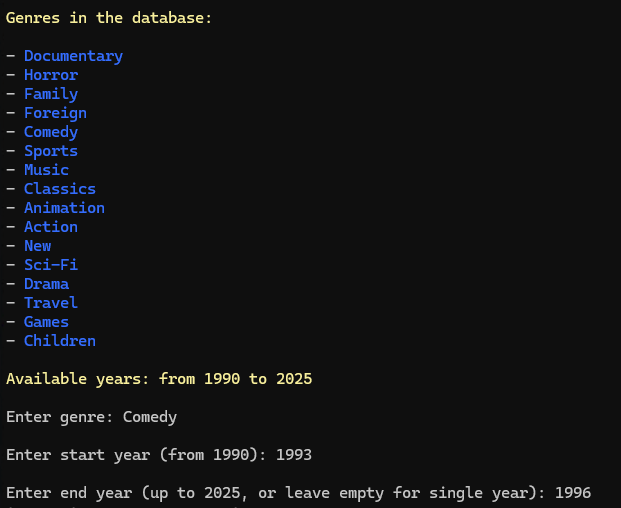
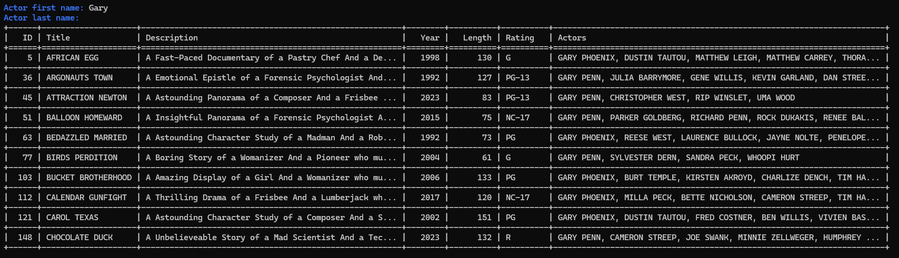
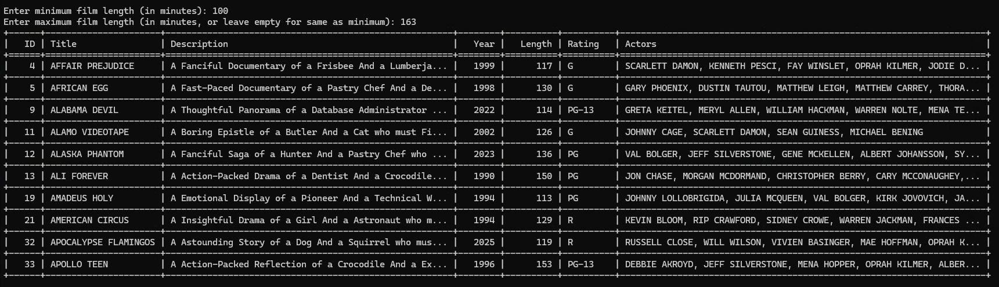
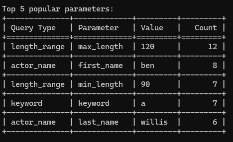
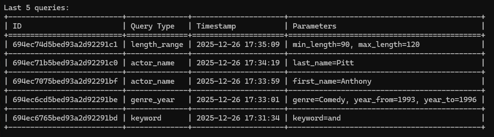
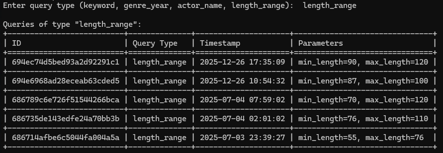
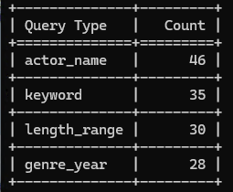

# Usage Guide

This document describes how to use the **Console Movie Search Application (Sakila)** from the terminal, including available menus, search modes, expected inputs, and application output.

---

## 1. Start the Application

From the project root directory, run:

```bash
python -m src.main
```

After launch, you will see the **Main Menu**.



---

## 2. Main Menu

The main menu contains three options:

1. **Search for films**
2. **Query statistics**
3. **Exit**

Select an option by entering the corresponding number.

### 2.1 Invalid Input Handling

If you enter a number outside the valid range (for example `5`), the application does not crash.
It displays a message such as:

> `Invalid choice. Please try again.`

and returns to the same menu.

---

## 3. Film Search

Choose:

**Main Menu → 1. Search for films**

You will see the **Film Search Menu** with four search methods:

1. **By keyword**
2. **By genre and year range**
3. **By actor (first and last name)**
4. **By film length**

Select a method by entering a number from **`1`** to **`4`**.

### 3.1 Invalid Input in Film Search Menu

If you enter a number outside `1–4`, the application displays:

> `Invalid search method selection.`

and returns to the Film Search Menu.

---

## 3.2 Search Method 1 — By Keyword

**Goal:** find films whose **title** contains a given word or phrase.

### Steps

1. Select **Film Search → 1. By keyword**
2. Enter a keyword (example: `world`)
3. The application displays a table with matching films



### Result Table Columns

* **ID** (film_id)
* **Title**
* **Description** (shortened)
* **Year**
* **Length**
* **Rating**
* **Actors** (shortened if long)

### Pagination

* Results are displayed in pages of **10 films**
* If more results are available, you will be prompted:

```
Show the next 10 results?
1 - Yes
2 - No
```

- Selecting **Yes** displays the next **10 results** and, if more results remain, the prompt is shown again
- Selecting **No** returns you to the Main Menu (or the previous menu depending on UI flow).

---

## 3.3 Search Method 2 — By Genre and Year Range

**Goal:** find films by **genre** and **release year range**.

### Steps

1. Select **Film Search → 2. By genre and year range**
2. The application displays a list of available genres
3. The application displays the **current minimum and maximum release years** based on the data available in the database:
> `Available years: from 1990 to 2025`
4. Enter a genre (example: `Comedy`)
   If the entered genre does not match any of the available genres, the application displays the following message:
> `Invalid genre. Please try again.`
  After that, the user is prompted to enter the genre again.
6. Enter a start year (example: `1993`)
7. Enter an end year (example: `1996`)
   If the entered year range is invalid, the application displays:
> `Year range is invalid. Please try again.`
  After that, the user is prompted to enter the year range again.



The end year can be left empty to search for a single year.

---

## 3.4 Search Method 3 — By Actor Name

**Goal:** find films featuring a specific actor.

### Steps

1. Select **Film Search → 3. By actor**
2. Enter:
   * actor first name (optional)
   * actor last name (optional)

### Examples

* Last name only:
  * first name: *(empty)*
  * last name: `Wayne`
    
* First name only:
  * first name: `Gary`
  * last name: *(empty)*
    
* Both names:
  * first name: `Uma`
  * last name: `Wood`



### Result

A table of films featuring matching actor(s) is displayed.  
The actor that matches the search criteria is displayed **first** in the **Actors** column.

---

## 3.5 Search Method 4 — By Film Length Range

**Goal:** find films by duration.

### Steps

1. Select **Film Search → 4. By film length**
   Before entering the length values, the application displays the **current minimum and maximum film length**,  
   calculated dynamically based on the data available in the database:
> `Available movie length range: from 46 to 185 minutes`
2. Enter the minimum film length (in minutes): *(example: `90`)*
3. Enter the maximum film length (in minutes): *(example: `120`)*
   If the maximum length is left empty, the search is performed using only the minimum length value.



### Result

A table of films whose duration falls within the specified length range is displayed.  
Search results are shown in ascending order by **film ID**.

---

## 4. Query Statistics

Choose:

**Main Menu → 2. Query statistics**

You will see the **Statistics Menu**:

Options:

1. **Top 5 popular queries**
2. **Last 5 queries**
3. **Search queries by type**
4. **Frequency by query type**

---

## 4.1 Top 5 Popular Search Parameters

**Goal:** identify the most frequently used search parameters.

### What It Does

* Reads query logs from MongoDB
* Extracts parameter values from `params`
* Counts repeated combinations
* Displays the top 5 results



### Output Columns

* Query Type
* Parameter
* Value
* Count

---

## 4.2 Last 5 Queries

**Goal:** display the most recent user searches.

### What It Does

* Fetches the last 5 MongoDB documents sorted by timestamp



### Output Columns

* ID (MongoDB ObjectId)
* Query Type
* Timestamp
* Parameters (non-empty only)

---

## 4.3 Search Queries by Type

**Goal:** filter queries by search category.

### Steps

1. Choose **Statistics → 3**
2. Enter a query type:
   * `keyword`
   * `genre_year`
   * `actor_name`
   * `length_range`



### Invalid Query Type

If the entered query type does not match any of the supported values, the application displays:
> `No queries found.`
After that, the application returns the user to the **Main Menu**.

---

## 4.4 Frequency by Query Type

**Goal:** show how often each search method is used.

### What It Does

* Groups MongoDB logs by `query_type`
* Counts occurrences
* Sorts by count descending



### Output Columns

* Query Type
* Count

---

## 5. Exit

Choose **Main Menu → 3. Exit**.

You will be asked to confirm:
1. **Yes, exit**
2. **No, return to main menu**

- Selecting **Yes** terminates the application and displays the message:
> `Goodbye!`
- Selecting **No** returns the user to the **Main Menu**.

This concludes the usage guide for the Console Movie Search Application.  
All features described above are accessible through the console interface.
